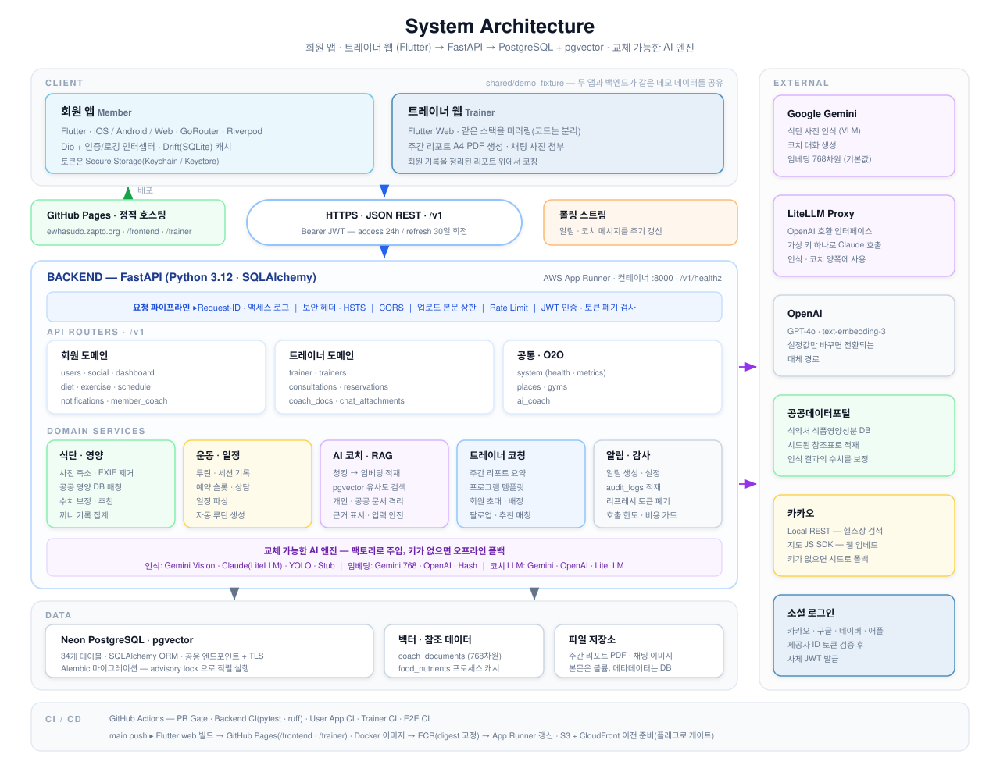

  

# On-care 

***HealthMate AI: 트레이너 연동 식단·운동 관리 서비스***

  

 

<em><b>On-Care</b> turns scattered trainer–member messaging into data-driven coaching — a member's meals and workouts are auto-organized into daily reports for their trainer, and the trainer's routines flow straight back into the member's app. Built for personal training, where results are decided between sessions.</em>

---

## Overview

**On-Care**는 헬스 트레이너와 회원 사이의 식단·운동 관리 소통을 자동화하는 플랫폼입니다. 회원이 음식 사진 한 장·간단한 입력만 하면 앱이 식단과 운동을 회원별·날짜별로 정리해 트레이너에게 전달하고, 트레이너는 흩어진 메시지를 뒤지는 대신 정리된 리포트 위에서 코칭합니다.

**타깃 유저**는 **PT를 이용하는 회원과 이들을 관리하는 트레이너**입니다. PT의 성과는 주 1~2회 대면 세션이 아니라 **세션과 세션 사이의 식단·운동 관리**에서 갈리지만, 정작 그 구간은 개인 메신저에 맡겨져 있습니다. On-Care는 트레이너의 관리를 세션 밖으로 확장하는 것을 목표로 합니다.

---

## Problem

트레이너와 회원 모두 **"기록은 하는데, 그 기록이 관리로 이어지지 않는"** 같은 벽에 부딪힙니다.

| 대상 | 현재 겪는 어려움 |
| --- | --- |
| 🏋️ **트레이너** | 담당 회원의 식사·운동을 개별 메신저로 일일이 확인하느라 세션 밖 시간을 쓰지만, 대화가 흩어져 회원별 흐름이 한눈에 보이지 않습니다. 회원이 늘수록 관리 품질이 떨어져 **확장이 어렵습니다.** |
| 🧍 **회원** | 매 끼 검색·입력하는 번거로움에 기록을 며칠 만에 포기하고, 어렵게 남긴 기록도 **"그래서 무엇을 바꿔야 하는지"** 로 이어지지 않습니다. 세션에서 배운 루틴도 기억에 의존해 재현합니다. |

이 문제를 겨냥한 서비스는 이미 많았지만 정착하지 못했습니다. 회원용 기록 앱과 트레이너용 도구가 **서로 분리되어**, 회원의 데이터가 트레이너에게 정리된 형태로 닿지 않기 때문입니다. 결국 관리는 다시 메신저로 돌아옵니다. On-Care는 바로 이 **끊어진 연결**을 잇습니다.

---

## Background Evidence & Data

헬스는 많은 사람이 선택하는 운동이지만, **운동과 식단을 꾸준히 기록하고 관리하는 일은 쉽게 지속되지 않습니다.**  
또한 여러 연구에서 **사람의 감독과 피드백이 운동 순응도와 행동 지속에 중요한 역할**을 하는 것으로 나타났습니다.

On-Care는 이러한 근거를 바탕으로 **기록을 더 쉽게 만들고, 회원의 기록을 트레이너의 지속적인 코칭으로 연결하는 것**에 집중합니다.

### ① 헬스는 이미 대중적인 운동이다

2025년 국민생활체육조사에서 규칙적 체육활동 참여자의 주 참여 종목 가운데 **보디빌딩(헬스)은 17.5%로 걷기(40.5%) 다음으로 높은 비중**을 차지했습니다.

| 지표 | 결과 |
| --- | --- |
| 규칙적 체육활동 참여자의 주 참여 종목 | **보디빌딩(헬스) 17.5%** |
| 전체 순위 | **걷기 다음 2위** |

헬스는 일부 전문 운동인만의 활동이 아니라, 이미 많은 사람이 일상적으로 선택하는 운동입니다.  
따라서 운동을 시작하는 것뿐 아니라 **시작한 운동을 어떻게 지속적으로 관리할 것인지** 역시 중요한 문제입니다.

---

### ② 하지만 운동을 지속하는 것은 어렵다

헬스장 회원 **5,240명을 최대 12개월간 추적한 연구**에서는 신규 회원의 **63%가 첫 3개월 이전에 운동을 중단**했고, 12개월 이상 지속한 회원은 4% 미만이었습니다.

| 연구 | 결과 |
| --- | --- |
| Fitness center 회원 5,240명 추적 | **63%가 3개월 이전 중단** |
| 12개월 이상 지속 | **4% 미만** |

이 연구는 브라질의 특정 피트니스센터 이용자를 대상으로 한 관찰연구이므로 모든 국내 헬스 이용자에게 동일하게 일반화할 수는 없습니다. 다만 **헬스 이용 초기에 높은 이탈이 발생할 수 있다는 점**을 보여줍니다.

On-Care가 해결하려는 문제 역시 단순히 운동 정보를 제공하는 것이 아니라, **회원이 운동을 시작한 이후에도 기록과 관리가 이어질 수 있도록 돕는 것**입니다.

---

### ③ 운동에서는 ‘감독’이 순응도와 성과에 영향을 준다

2025년 발표된 10주간의 무작위 대조시험(RCT, n=79)은 동일한 저항운동을 수행하는 참가자를 **대면 감독, 앱 가이드, 자율 운동** 세 그룹으로 비교했습니다.

운동 순응도는 다음과 같았습니다.

| 방식 | 운동 순응도 |
| --- | ---: |
| **대면 감독** | **88.2%** |
| 앱 가이드 | 81.2% |
| 자율 운동 | 52.2% |

또한 스쿼트 1RM은 세 그룹 모두 증가했지만, **대면 감독군의 증가량(+26.6kg)이 앱 가이드군(+19.2kg)과 자율 운동군(+19.4kg)보다 유의하게 컸습니다.**

별도의 체계적 문헌고찰 및 메타분석에서도 12개 연구, 총 577명을 분석한 결과 **감독이 있는 저항운동이 비감독 운동보다 근력 향상에 유리한 효과(SMD 0.40, 95% CI 0.06–0.74)**를 보였습니다.

이러한 결과는 앱이 트레이너를 대체해야 한다기보다, **운동 과정에서 사람의 감독과 코칭이 여전히 중요한 역할을 한다는 점**을 보여줍니다.

---

### ④ 기록은 시간이 지나며 감소하고, 피드백은 이를 보완할 수 있다

식단을 모바일 기기로 자기기록한 성인 124명의 데이터를 분석한 연구에서는 **모든 기록 기준에서 10주 이후 기록을 지속한 참가자가 절반 미만**으로 감소했습니다.

또한 하루 두 번 이상의 식사 기록을 남긴 일수를 기준으로 한 자기기록 순응도는 **6개월 체중 변화의 분산 중 27%를 설명**했습니다.

즉, 기록 자체가 의미 있는 행동이지만 **꾸준히 기록하도록 만드는 것이 또 다른 문제**입니다.

24개월간 진행된 별도의 무작위 대조시험에서는 종이 기록, 디지털 기록, 디지털 기록과 일일 맞춤 피드백을 비교했습니다. 디지털 기록은 자기기록 순응도를 높였으며, **일일 맞춤 피드백을 함께 받은 그룹에서는 24개월 시점에도 유의한 체중 감소가 관찰되었습니다.**

다만 이 연구들은 체중 감량을 목적으로 한 행동중재 연구이므로 PT 서비스의 효과를 직접 검증한 것은 아닙니다. 대신 **기록을 디지털화하는 것뿐 아니라 기록 이후 적절한 피드백을 연결하는 설계의 가능성**을 보여줍니다.

---

### 그래서 On-Care는

기존 연구들이 보여주는 것은 하나의 서비스에 대한 정답이 아니라 각각의 문제입니다.

**운동은 시작해도 지속하기 어렵고,**  
**운동 과정에서 감독은 순응도와 성과에 영향을 주며,**  
**기록은 시간이 지나면서 감소하지만 피드백은 행동 지속을 보조할 수 있습니다.**

On-Care는 이 근거들을 바탕으로 다음과 같은 흐름을 설계했습니다.

**회원의 식단·운동 기록 → 자동 정리 → 트레이너 확인 및 코칭 → 회원에게 피드백·프로그램 반영**

트레이너를 AI로 대체하는 것이 아니라, **대면 세션에서 끝나던 트레이너의 관리를 회원의 일상 기록과 연결해 세션 사이까지 이어지게 하는 것**이 On-Care의 핵심입니다.

Sources —  
[2025년 국민생활체육조사, 문화체육관광부](https://www.mcst.go.kr/site/s_policy/subPolicy/sportstour/sportstour29.jsp) ·  
[Sperandei et al., *Journal of Science and Medicine in Sport*, 2016](https://pubmed.ncbi.nlm.nih.gov/26874647/) ·  
[Gavanda et al., *Journal of Strength and Conditioning Research*, 2025](https://pubmed.ncbi.nlm.nih.gov/40728831/) ·  
[Fisher et al., *International Journal of Strength and Conditioning*, 2022](https://journal.iusca.org/index.php/Journal/article/view/101) ·  
[Turner-McGrievy et al., *Journal of the Academy of Nutrition and Dietetics*, 2019](https://pubmed.ncbi.nlm.nih.gov/31155473/) ·  
[Burke et al., *American Journal of Preventive Medicine*, 2012](https://pubmed.ncbi.nlm.nih.gov/22704741/)

---

## Solution

회원의 기록은 앱 안에서 자동으로 정리되어 트레이너에게 넘어가고, 트레이너의 코칭은 다시 회원에게 돌아옵니다. 회원은 최소한의 노력으로 관리받고, 트레이너는 더 많은 회원을 더 높은 품질로 관리하며, 그 사이의 모든 판단은 감이 아닌 **데이터**를 근거로 이루어집니다.

---

## Key Features

| 기능 | 설명 |
| --- | --- |
| 📷 **간편 식단 기록** | 음식 사진을 찍으면 AI(VLM)가 음식과 양을 추정하고, 식약처 공공 DB의 영양성분 참고값을 조회해 나트륨·칼로리·당 추정치를 제공합니다. 완벽한 자동 계산이 아니라 기록 부담을 없애는 것이 목적이며, **최종 값은 회원·트레이너가 확인·보정**해 신뢰도를 높입니다. |
| 🏋️ **운동 기록 자동 연동** | 트레이너가 세션에서 입력한 프로그램·수행이 회원 기록에 자동 반영되어, 회원이 일일이 적지 않아도 데이터가 쌓입니다. |
| 📊 **자동 요약 리포트** | 식단·운동·활동을 회원별·날짜별로 묶어 트레이너에게 전달합니다. *"이 회원, 이번 주 나트륨 과다 · 유산소 부족"* 을 한눈에 파악합니다. |
| 🔗 **데이터 기반 매칭** | 회원의 목표와 조건(지역·시간·성향)에 맞춰 트레이너·헬스장을 추천하고 앱 안에서 연결합니다. |
| 🎯 **목표·미션 관리** | 회원의 목표에 맞춘 영양·활동량 목표와 일일 미션. 많이 먹은 날은 활동량을, 적게 먹은 날은 식단을 조정하는 **식단↔운동 연동 코칭**을 제공합니다. |

---

## Diet Recognition Pipeline

사진에서 시작해 VLM이 음식과 양을 추정하고, **공공 영양성분 DB 참고값**으로 추정치를 보정한 뒤, 구조화된 기록과 트레이너 리포트로 이어집니다. 최종 값은 회원·트레이너가 확인·수정할 수 있습니다.

---

## System Architecture

---

## Tech Stack

| 영역 | 사용 기술 |
| --- | --- |
| **Frontend** | Flutter · Dart · Riverpod · GoRouter (회원 앱(모바일) · 트레이너 웹 — 분리된 코드베이스, 아키텍처 패턴 미러링) |
| **Backend** | FastAPI · SQLAlchemy · Alembic · JWT · Docker |
| **Database** | PostgreSQL · pgvector |
| **AI** | Vision(VLM) 식단 인식 · 식약처 공공 영양성분 DB 매칭 · RAG 코치 |
| **Infra** | 백엔드 AWS ECR + App Runner · 프론트 GitHub Pages(커스텀 도메인) · GitHub Actions (CI/CD) |
| **External API** | 카카오 (지도 JS SDK · 로컬 장소 검색 · 소셜 로그인) · 공공데이터포털 (식약처 영양성분) |

---

## Docs

| 문서 | 내용 |
| --- | --- |
| [로컬 풀스택 실행](docs/local_fullstack.md) | 백엔드·회원 앱·트레이너 웹을 한 대에서 띄우는 절차 |
| [API 계약](backend/API_CONTRACT.md) | 엔드포인트·요청/응답 스키마 |
| [프론트엔드 배포](docs/frontend_deployment.md) | GitHub Pages 배포 구조와 운영 절차 |
| [백엔드 배포](backend/docs/DEPLOY.md) | 컨테이너 이미지·마이그레이션·환경변수 |

---

## Competitive Analysis

| 항목 | 필라이즈 | 밀리그램·인아웃 | **On-Care** |
| --- | :---: | :---: | :---: |
| **식단 기록** | 사진 AI 인식 | 사진·빠른 입력 | **사진 → 공공 영양 DB 매칭** |
| **트레이너 연동** | 앱 내 AI 코치만 | 없음 | **회원 데이터 자동 정리 → 트레이너 전달** |
| **회원 관리 확장성** | 없음 | 없음 | **1인이 다수 회원을 데이터로 관리** |
| **세션 밖 코칭** | AI 응답만 | 없음 | **담당 트레이너의 실제 코칭이 앱으로 연장** |
| **데이터 흐름** | 개인 앱 내 완결 | 개인 앱 내 완결 | **회원 ↔ 트레이너 양방향** |

> 기존 서비스는 회원 개인의 기록에서 끝납니다. On-Care는 그 기록을 **트레이너의 코칭 자원으로 연결**하는 흐름 자체가 차별점입니다.

---

## Target &amp; Business Model

On-Care의 **핵심 타깃**은 **PT를 이용하는 회원과 이들을 관리하는 트레이너**입니다. 회원은 이미 PT에 비용을 지불하고 있는 층이라 관리 품질에 대한 지불 의사가 높고, 트레이너는 담당 회원 수가 곧 수익인 만큼 **관리 효율을 높이는 도구에 직접적인 구매 동기**를 가집니다.

| 구분 | 모델 |
| --- | --- |
| **메인** | 트레이너·헬스장 **중개 수수료 / 구매 전환 커미션** · 트레이너용 **고도화 기능 구독** |
| **프리미엄** | 기본 기능은 무료로 진입장벽을 낮추고, 가치를 체감한 사용자가 고도화 기능을 결제 |
| **부수** | 광고(상위 노출 등)는 보조 수입으로만 |

> **확장 방향** — PT에서 자리 잡은 뒤에는 같은 구조(전문가가 개인의 생활 관리를 지속적으로 지도하는 관계)를 필라테스·요가 스튜디오, 기업 임직원 건강관리, 재활·시니어 운동 지도로 넓힐 수 있습니다.

---

## Team

|                                                         최지수                                                          |                                                            박서연                                                            |                                                           신수빈                                                           |
|:--------------------------------------------------------------------------------------------------------------------:|:-------------------------------------------------------------------------------------------------------------------------:|:-----------------------------------------------------------------------------------------------------------------------:|
|  |  |  |
|                                         [@aJISUa](https://github.com/aJISUa)                                         |                                      [@seoyeon0516](https://github.com/seoyeon0516)                                       |                                       [@subin21cc](https://github.com/subin21cc)                                        |

> *지도교수: 황의원 교수님 (이화여자대학교 · 컴퓨터공학전공)*

---

## License

본 프로젝트는 [MIT License](LICENSE) 하에 배포됩니다. 자세한 내용은 [`LICENSE`](LICENSE) 파일을 참고하세요.

> Copyright © 2026 On-Care Team (CSE-Sudo: 최지수 · 박서연 · 신수빈)

 

---

**2026 이화여자대학교 캡스톤디자인**

*Team 02 Sudo — Jisu Choi · Seoyeon Park · Subin Shin*

